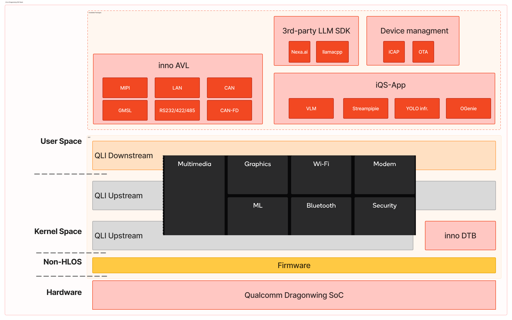
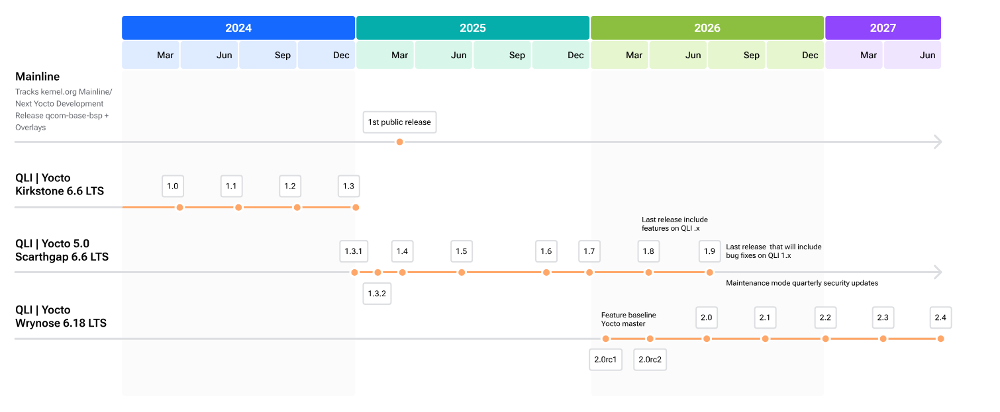
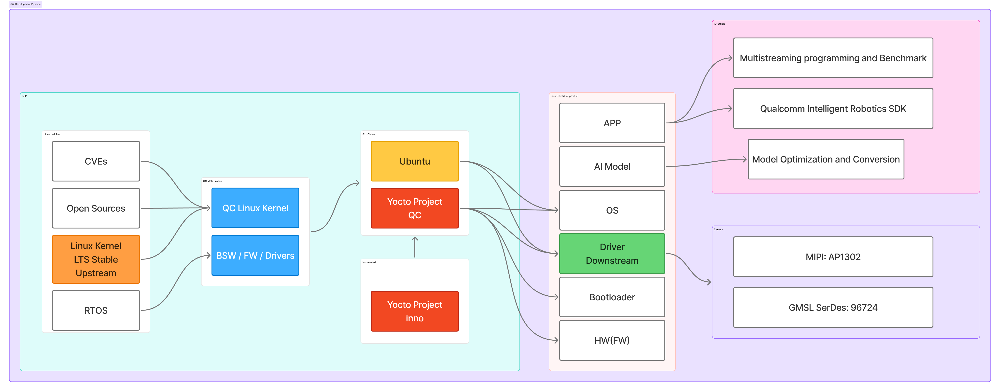

<!--
 Copyright (c) 2025 Innodisk Corp.
 
 This software is released under the MIT License.
 https://opensource.org/licenses/MIT
-->
# iQ Studio

  <br />
  <div align="center"></div>
  <br />

  <h1 align="center"><em><strong>Show Performance, Spark Imagination.</strong></em></h1>

  <h3 align="center">It helps users quickly understand, explore, and prototype ideas by showcasing the platform’s performance and capabilities—inspiring innovation through hands-on experience.</h3>

> [!NOTE]
> iQ-Studio is suitable for a range of products developed based on the [Innodisk Qualcomm Dragonwing SoC](https://www.innodisk.com/en/news/innodisk-unveils-ai-on-dragonwing-computing-series).


# Core Software Stack & Architecture

iQ-Studio is built upon a robust edge AI software stack, bridging the gap between hardware and high-level applications:

<br />
<div align="center"></div>
<br />

- **Hardware & Firmware**: [Qualcomm Dragonwing QCS9075 SoC](https://www.innodisk.com/en/products/computing/qualcomm-solution/exmp-q911) and low-level firmware.
- **Kernel Space**: Powered by [Qualcomm Linux](https://www.qualcomm.com/developer/software/qualcomm-linux), integrated with our custom Inno DTB/drivers and Yocto environments. 
- **User Space**: Seamlessly supports 3rd-party LLM SDKs, device management ([iCAP](https://www.innodisk.com/en/products/software-icap)), and inno AVL. At the very top sits the **[iQS-App layer](./README.md#explore-documentation--resources)** (VLM, Streampipe, YOLO, OGenie).

### Qualcomm Linux (QLI) Version Mapping

Our architecture evolves alongside the [Qualcomm Linux Roadmap](https://www.qualcomm.com/developer/software/qualcomm-linux), ensuring alignment with the latest kernel and Yocto Project releases:

| Linux Kernel | Yocto Project | Qualcomm Linux (QLI) Release |
| :--- | :--- | :--- |
| **6.6 LTS** | 4.0 Kirkstone | QLI 1.x |
| **6.6 LTS** | 5.0 Scarthgap | QLI 1.x |
| **6.18 LTS** | Wrynose (Master) | QLI 2.x |

<br />
<div align="center"></div>
<br />

We ensure a continuous and stable pipeline—from upstream Linux/Yocto projects down to the optimized downstream drivers—unlocking peak performance for edge AI workloads.

<br />
<div align="center"></div>
<br />  

We also provide integrated and supplied [Ubuntu images](https://ubuntu.com/download/qualcomm-iot#evaluation-kit) for development.

# How to Deploy iQ Studio?

Before getting started, please refer to the [Starting Guides](./tutorials/starting-guides/) to boot up your platform. As with the Q911 series, please refer to the [EXMP-Q911 Starting Guide](./tutorials/starting-guides/q911/README.md).

iQ Studio enables users to run applications quickly. It supports both online and offline modes, ensuring that applications can run even without internet access. Currently, we provide two types of application packages—docker images and IPK packages—that can be executed with IQ Studio.

If you are using online mode (with internet access), you only need to install the iQ studio github repository on the platform and run our applications by following the tutorial commands. For usage instructions, please refer to the [Quick Start guide](./README.md#quick-start).

  <br />
  <div align="center"></div>
  <br />

If you must use offline mode (without internet access), you need to first transfer the required packages and the iQ studio github repository to the platform before you can run the applications in an offline environment. For usage instructions, please refer to the [how to install offline package](./docs/how-to-install-offline-package-using-iqs-launcher.md).

  <br />
  <div align="center"></div>
  <br />

We verify the BSP version on the platform to ensure that applications run correctly. This check is automatically handled by `iqs-launcher`. However, it is important to confirm that the BSP version on your system matches the one specified in the tutorial before running any application.

## Quick Start

### Install iQ Studio

```bash
git clone https://github.com/InnoIPA/iQ-Studio.git
cd iQ-Studio
./install.sh
```
>Note: If you are using Ubuntu, please log in again after installation.

### Run Application

For example, If you want to run the [iQ-VLM](./tutorials/applications/iqs-vlm/README.md). You just need two command run the interative real-time demo.

Launch the OGenie API server:
```bash
$ iqs-launcher --autotag iqs-ogenie
```
Real-Time Display of VLM Predictions on the Monitor.
```bash
$ iqs-launcher --autotag iqs-vlm-demo
```
This is provides a real-time display of VLM predictions, allowing you to quickly verify inference results.

<br />
<div align="center"></div>
<br />

For other applications, please refer to the [documentation section below](#explore-documentation--resources).

## Explore Documentation & Resources

iQ Studio resources are grouped into categories based on functionality:


<table>
  <col style="width: 30%">
  <col style="width: 30%">
  <col style="width: 40%">
  <thead>
    <tr>
      <th>Categories</th>
      <th>Description</th>
      <th>Topic</th>
    </tr>
  </thead>
  <tbody>
    <tr>
      <td>Starting Guides</td>
      <td>Quick-start guides for evertthing.</td>
      <td>
        <ul>
          <li><a href="./tutorials/starting-guides/q911/README.md">Q911 Quick Start Guide</a></li>
          <li><a href="./tutorials/starting-guides/flash-image/README.md">Q911 Image Flashing Guide</a></li>
        </ul>
      </td>
    </tr>
    <tr>
      <td>AVL(Approved Vendor List)</td>
      <td>Provides guidance on verifying that the driver starts correctly on the system and quickly demonstrating the validated results.</td>
      <td>
        <ul>
          <li><a href="./tutorials/avl/README.md">Approved Vendor List</a></li>
          <li><a href="./tutorials/avl/gmsl-camera/README.md">GMSL Camera</a></li>
          <li><a href="./tutorials/avl/mipi-camera/README.md">MIPI Camera</a></li>
        </ul>
      </td>
    </tr>
    <tr>
      <td>Applications</td>
      <td>Application-level examples focused on specific use cases and vertical scenarios.</td>
      <td>
        <ul>
          <li><a href="./tutorials/applications/iqs-vlm/README.md">iQS-VLM</a></li>
          <li><a href="./tutorials/applications/iqs-streampipe/README.md">iQS-Streampipe</a></li>
          <li><a href="./tutorials/applications/iqs-yolov10n/README.md">YOLOv10n INT8 Inference on GPU and NPU</a></li>
        </ul>
      </td>
    </tr>
    <tr>
      <td>SDKs</td>
      <td>Documentation and examples on how to use the SDKs effectively.</td>
      <td>
        <ul>
          <li><a href="./tutorials/sdks/iqs-vlm/README.md">iQS-VLM: How to Interact with the OGenie Server through Open WebUI</a></li>
          <li><a href="./tutorials/sdks/iqs-streampipe/README.md">iQS-Streampipe: How to Change the Custom Model and Video Source</a></li>
          <li><a href="./tutorials/sdks/iqs-ogenie/README.md">iQS-OGenie: Run Your Own Demo with OGenie Server</a></li>
        </ul>
      </td>
    </tr>
    <tr>
      <td>Benchmarks</td>
      <td>Performance tests and comparisons across platforms.</td>
      <td>
        <ul>
          <li><a href="./benchmarks/innoppe/README.md">InnoPPE Benchmark Between Jetson AGX and Qualcomm QCS9075</a></li>
          <li><a href="./benchmarks/iqs-streampipe/README.md">Multi-stream Inference Status on Jetson AGX and Qualcomm QCS9075</a></li>
          <li><a href="./benchmarks/perception_model/README.md">Perception AI Benchmark between QCS9075 and Jetson AGX </a></li>
        </ul>
      </td>
    </tr>
  </tbody>
</table>

## Changelog

Please refer to the [Changelog](./docs/changelog.md) for all updates.

## License

This project is licensed under the MIT License. See [LICENSE](./LICENSE) for details.