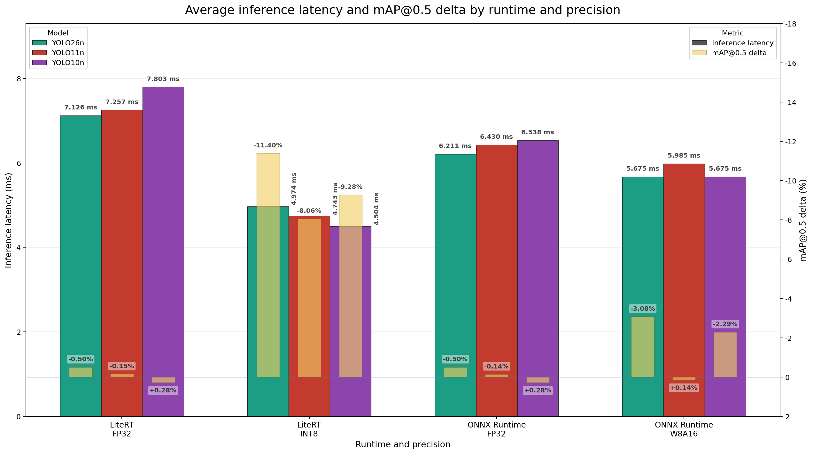

<!--
 Copyright (c) 2025 Innodisk Corp.

 This software is released under the MIT License.
 https://opensource.org/licenses/MIT
-->

# iQ-Foundry Model Benchmark

This benchmark compares [iQ-Foundry](https://github.com/InnoIPA/iQ-Foundry) model conversions and their measured performance on EXMP-Q911.

## Overview

This page compares the accuracy, deployment size, and on-device inference performance of the model combinations supported by [iQ-Foundry](https://github.com/InnoIPA/iQ-Foundry). The results help users select an appropriate model based on accuracy, inference latency, model size, runtime compatibility, and deployment requirements.

These results provide comparison data rather than a universal model ranking. Select a model according to the requirements of your application and deployment environment.

## How to Read the Results

- **Converted mAP@0.5** indicates the measured detection accuracy after conversion.
- **mAP delta** shows the percentage change relative to the original reference model. A negative delta means that measured accuracy decreased after conversion, while a positive delta means that the converted result was slightly higher on this evaluation subset.
- **Inference time** is the average model invocation latency on the target device.
- **Model size** indicates the storage size of the converted deployment model.

## Hardware and Benchmark Environment

### Hardware

| Item | Configuration |
| --- | --- |
| Target device | EXMP-Q911 (Qualcomm QCS9075) |
| Inference accelerator | Qualcomm HTP/NPU |
| Power plan | 30 W (High Performance mode) |
| AI performance | 100 TOPS (Dense) |

### Benchmark Environment

| Item | Configuration |
| --- | --- |
| Dataset | [COCO 2017 validation dataset]((https://cocodataset.org/#download) )|
| Evaluation subset | First 300 validation images |
| Evaluation images | 300 |
| Confidence threshold | 0.25 |
| NMS IoU threshold | 0.7 |
| Maximum detections | 300 |
| Reference model | Pretrained YOLO model from [Ultralytics](https://docs.ultralytics.com/models#featured-models) |

> [!NOTE]
> All mAP evaluations and inference-latency measurements used the first 300 images from the COCO 2017 validation dataset. The reference models were pretrained YOLO models obtained from Ultralytics, and all converted models were generated and evaluated using iQ-Foundry. Inference latency refers to model invocation latency rather than complete application pipeline latency.

## Benchmark Overview



The chart provides a visual comparison of mAP change and model invocation latency across runtime and precision combinations.

## Results

### LiteRT

| Model    | Precision | mAP@0.5 (Reference) | mAP@0.5 (Converted) | mAP Delta (%) | Inference Time (ms) | Model Size (MB) |
| -------- | --------- | ------------------: | ------------------: | ------------: | ------------------: | --------------: |
| yolov26n | FP32      |              0.5232 |              0.5205 |        -0.50% |               7.126 |             9.7 |
| yolov11n | FP32      |              0.5287 |              0.5279 |        -0.15% |               7.257 |            10.5 |
| yolov10n | FP32      |              0.5258 |              0.5273 |        +0.28% |               7.803 |             9.3 |
| yolov26n | INT8      |              0.5232 |              0.4635 |       -11.40% |               4.974 |             2.8 |
| yolov11n | INT8      |              0.5287 |              0.4860 |        -8.06% |               4.743 |             2.9 |
| yolov10n | INT8      |              0.5258 |              0.4770 |        -9.28% |               4.504 |             2.6 |


### ONNX Runtime

| Model    | Precision | mAP@0.5 (Reference) | mAP@0.5 (Converted) | mAP Delta (%) | Inference Time (ms) | Model Size (MB) |
| -------- | --------- | ------------------: | ------------------: | ------------: | ------------------: | --------------: |
| yolov26n | FP32      |              0.5232 |              0.5205 |        -0.50% |               6.211 |             8.7 |
| yolov11n | FP32      |              0.5287 |              0.5280 |        -0.14% |               6.430 |             9.3 |
| yolov10n | FP32      |              0.5258 |              0.5273 |        +0.28% |               6.538 |             8.2 |
| yolov26n | W8A16     |              0.5232 |              0.5071 |        -3.08% |               5.675 |             4.9 |
| yolov11n | W8A16     |              0.5287 |              0.5294 |        +0.14% |               5.985 |             5.2 |
| yolov10n | W8A16     |              0.5258 |              0.5137 |        -2.29% |               5.675 |             4.6 |

## Conclusion

There is no single best model for every deployment. Choose a model by considering:

- Required detection accuracy
- Acceptable accuracy reduction
- Inference-latency requirement
- Model-size limitation
- Runtime compatibility
- Deployment environment

FP32 provides the closest measured accuracy to the reference models in this benchmark. The quantized models provide reduced size and lower measured invocation latency, with model-dependent accuracy changes. Evaluate these trade-offs according to the requirements of your use case.

For application-based recommendations, see the [iQ-Foundry Model Selection Guide](../../tutorials/model-deploy/iqf-model-guide/README.md).

## Benchmark and Deploy Your Model

Use the following workflow to convert a supported YOLO model, evaluate its converted accuracy, deploy it to EXMP-Q911, and measure model invocation latency. Before starting, complete the iQ-Foundry host setup for your operating system:

- [Windows Host Guide](https://github.com/InnoIPA/iQ-Foundry/blob/main/Windows_host.md)
- [Ubuntu Host Guide](https://github.com/InnoIPA/iQ-Foundry/blob/main/Ubuntu_host.md)

The workflow has three stages:

1. Convert the model for the selected runtime and precision using `qc`.
2. Compare the reference and converted model accuracy using `mAP`.
3. Deploy the converted model through ADB and measure invocation latency using `test`.

Replace the placeholder paths in the commands below with the paths for your model and evaluation data.

### Convert the Model for Deployment

Run the following command from the iQ-Foundry repository root to create a deployment model:

```bash
$ ./docker/iqf run qc \
  --type <yolov10|yolov11|yolov26> \
  --runtime <litert|onnx> \
  --precision <fp32|int8|w8a16> \
  --model /path/to/model.pt \
  --calib_dir /path/to/calibration_images
```

> Note: `--calib_dir` is required for quantized conversion. Omit `--calib_dir` for FP32 conversion.

Use one of the following runtime and precision supported combinations:

| Runtime | Precision |
| --- | --- |
| LiteRT | FP32 |
| LiteRT | INT8 |
| ONNX Runtime | FP32 |
| ONNX Runtime | W8A16 |

### Evaluate Conversion Accuracy

Compare the reference and converted model accuracy at mAP@0.5:

```bash
$ ./docker/iqf run mAP \
  --type <yolov10|yolov11|yolov26> \
  --runtime <litert|onnx> \
  --precision <fp32|int8|w8a16> \
  --annotations /path/to/annotations.json \
  --images /path/to/validation_images \
  --reference-model /path/to/reference_model.pt \
  --converted-model /path/to/converted_model \
  --conf 0.25 \
  --nms 0.7 \
  --max-det 300 \
  --max-images 300
```

The generated report contains the reference mAP, converted mAP, and mAP change. Use these results to assess the accuracy impact of conversion for your deployment.

### Deploy and Measure Inference Latency

Deploy the converted model to EXMP-Q911 through ADB and measure model invocation latency:

```bash
$ ./docker/iqf run test \
  --type <yolov10|yolov11|yolov26> \
  --runtime <litert|onnx> \
  --precision <fp32|int8|w8a16> \
  --model /path/to/converted_model \
  --yaml /path/to/classes.yaml \
  --images /path/to/benchmark_images \
  --conf 0.25 \
  --nms 0.7 \
  --max-det 300 \
  --adb
```

The target EXMP-Q911 must be connected and visible through ADB. To compare your latency result with this page, `/path/to/benchmark_images` should contain the same first 300 COCO validation images used for the published benchmark.

At the end of the command output, record:

```text
avg_model_invoke_ms
```

This value represents the average model invocation latency.

> [!IMPORTANT]
> Use evaluation data that represents your deployment requirements. When comparing your results with this benchmark, use the same dataset, image subset, thresholds, device, power mode, runtime, and latency-measurement method. Results may vary with device software, runtime versions, model conversion settings, calibration data, thermal state, and application workload.
