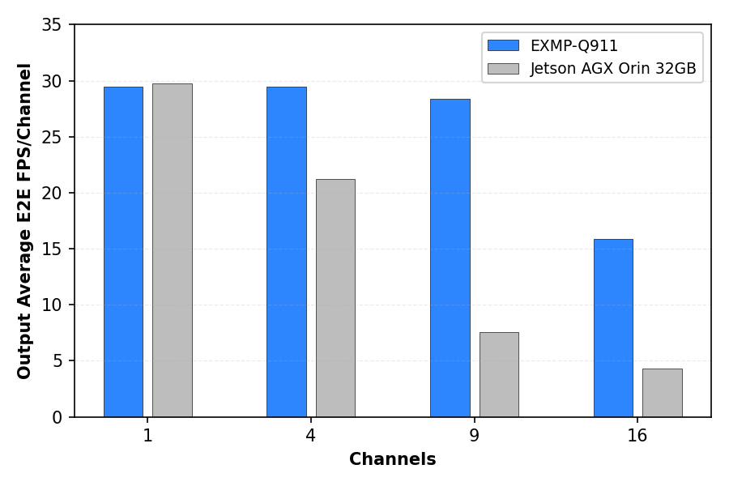
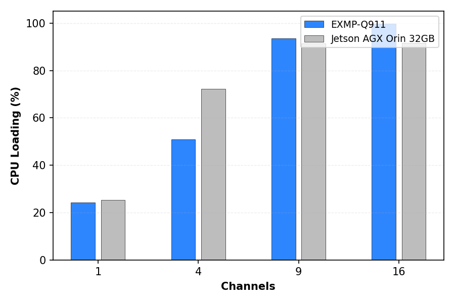
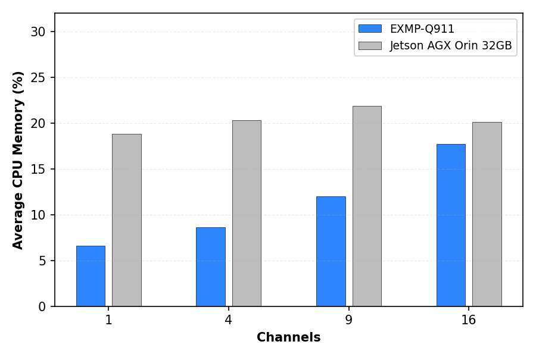
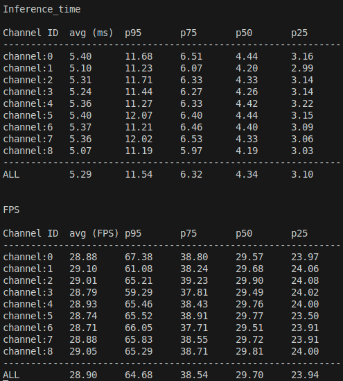
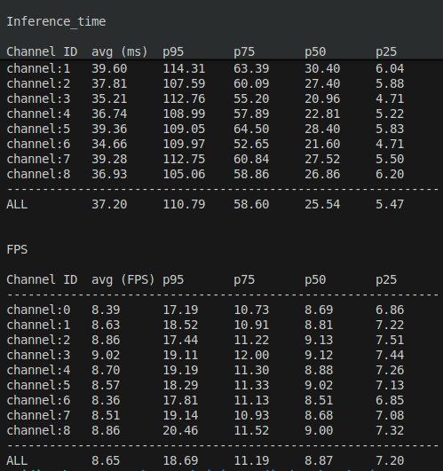

<!--
 Copyright (c) 2025 Innodisk Corp.
 
 This software is released under the MIT License.
 https://opensource.org/licenses/MIT
-->

# Multi-stream inference status on Jetson AGX and Qualcomm QCS9075

This topic describes a multi-stream inference benchmark for the iQS-Streampipe
application on the NVIDIA Jetson AGX Orin 32GB and the EXMP-Q911 platform.
The purpose is to observe execution behavior as the number of channels
increases. The results are not intended to be a general hardware performance
ranking. For live multi-stream inference on the recording platform, please check [here](./fig/nv_qc_live.mp4).

- Application: [iQS-Streampipe](../../tutorials/applications/iqs-streampipe/README.md)
- Task: object detection with an INT8 model
- Input: 1080p, 30 FPS H.264 video streams
- Platforms: Jetson AGX Orin 32GB, EXMP-Q911 (Qualcomm IQ-9075-based module)
- Metrics:
  - Output average end-to-end FPS per channel
  - Average CPU loading (%)
  - Average CPU memory usage (%)
  - Output end-to-end FPS percentiles (P95, P75, P50, P25)
- Channel counts: 1, 4, 9, 16

## Hardware

The benchmark uses two edge AI platforms with the configurations shown below.

| **Platform**        | NVIDIA Jetson AGX Orin 32GB                        | EXMP-Q911 (IQ-9075)                         |
|:--------------------|:----------------------------------------------------|:--------------------------------------------|
| **SoM / SoC**       | NVIDIA Jetson AGX Orin 32GB                        | Qualcomm IQ-9075                            |
| **Power plan**      | MAXN                                                | Normal                                      |
| **Processor cores** | 8                                                   | 8                                           |
| **AI accelerator**  | GPU                                                 | NPU                                         |
| **AI runtime**      | TensorRT 10.3.0.30                                  | TFLite (QNN 2.32)                           |
| **AI performance**  | 200 TOPS                                            | 100 TOPS                                    |
| **Linux kernel**    | 5.15.148-rt-tegra (PREEMPT_RT)                      | 6.6.97-qli-1.6-ver.1.2.1-05029-g53c11c30e98d (PREEMPT) |


## AI model

| **Architecture** | **Numerical precision** | **Parameters** | **Input size** | **Model size** | **Model format** | **Dataset**        | **Classes** |
|:-----------------|:------------------------|:---------------|:---------------|:---------------|:-----------------|:-------------------|:------------|
| YOLOv10n         | INT8                    | 2.3 M          | 640 × 640      | 2.32 MB        | TFLite           | Innodisk PPE       | 5          |


## Videos

| **File type** | **Resolution** | **Frame rate** | **Codec** | **Bitrate** | **File size** | **Length** |
|:--------------|:---------------|:---------------|:----------|:------------|:--------------|:-----------|
| MP4           | 1080p          | 30 FPS         | H.264     | 3524 kb/s   | 45.37 MB      | 27 s       |

## Results

### Measurement summary

| **Platform**                   | **Channels** | **Cores** | **Warm-up (s)** | **Power mode** | **CPU loading (%)** | **Average CPU memory (%)** | **Output average E2E FPS/channel** | **P95 (E2E FPS)** | **P75 (E2E FPS)** | **P50 (E2E FPS)** | **P25 (E2E FPS)** |
|:------------------------------|:------------:|:---------:|:---------------:|:---------------|:--------------------:|:---------------------------:|:----------------------------------:|:------------------:|:------------------:|:------------------:|:------------------:|
| **EXMP-Q911**                 |      1       |     8     |       180       | Normal         |        24.2          |            6.6              |               29.46                |       31.05        |       30.41        |       30.00        |       29.62        |
| **EXMP-Q911**                 |      4       |     8     |       180       | Normal         |        51.0          |            8.6              |               29.47                |       32.53        |       30.60        |       30.00        |       29.44        |
| **EXMP-Q911**                 |      9       |     8     |       180       | Normal         |        93.6          |           12.0              |               28.41                |       59.88        |       37.55        |       29.55        |       24.25        |
| **EXMP-Q911**                 |      16      |     8     |       180       | Normal         |        99.8          |           17.7              |               15.90                |       44.17        |       24.00        |       16.91        |       12.86        |
| **NVIDIA Jetson AGX Orin 32GB** |    1       |     8     |       180       | MAXN           |        25.3          |           18.8              |               29.78                |       39.78        |       31.28        |       29.82        |       28.55        |
| **NVIDIA Jetson AGX Orin 32GB** |    4       |     8     |       180       | MAXN           |        72.3          |           20.3              |               21.26                |       52.68        |       30.59        |       22.23        |       17.13        |
| **NVIDIA Jetson AGX Orin 32GB** |    9       |     8     |       180       | MAXN           |        91.5          |           21.9              |                7.58                |       18.09        |       10.46        |        7.88        |        6.11        |
| **NVIDIA Jetson AGX Orin 32GB** |    16      |     8     |       180       | MAXN           |        91.7          |           20.1              |                4.29                |        8.86        |        5.75        |        4.46        |        3.54        |

<p align="center">
  
  
  
</p>

- The FPS plot (left) shows that both platforms keep per-channel FPS close to
  30 at lower channel counts and gradually lose per-channel throughput as
  channels increase; EXMP-Q911 stays nearer to real-time at medium and higher
  channel counts, while Jetson AGX Orin drops earlier.

- The CPU loading plot (middle) shows low utilization at 1 channel and a
  steady increase as more channels are added, with both platforms near or at
  high CPU usage at 9 and 16 channels; the points where CPU load approaches
  saturation align with the visible per-channel FPS reductions.

- The CPU memory plot (right) shows that memory usage rises with channel
  count on both platforms but remains in a moderate range; in this benchmark,
  scaling behavior is dominated by CPU load and per-channel FPS rather than
  memory capacity limits.

## Conclusion

Under the aligned 8-core configuration, both systems show the same pattern:
as channel count increases and CPU usage approaches saturation, per-channel
FPS drops from near real-time to lower values. In this workload, near
real-time FPS per channel is sustained up to 9 channels on EXMP-Q911, while
on NVIDIA Jetson AGX Orin 32GB the per-channel FPS is already below
real-time at higher channel counts as the load increases.

## Benchmark method

Below is an overview of how we conduct platform benchmark testing.

### EXMP-Q911 

1. Install iQ Studio
   ```
   git clone https://github.com/InnoIPA/iQ-Studio.git
   cd iQ-Studio
   ./install.sh
   ```

2. From the repository root on EXMP-Q911, change to the benchmark directory:

   ```bash
   $ cd benchmarks/iqs-streampipe
   ```

3. Edit `config.json` so that the `streams` array contains 1, 4, 9, or 16
   entries, depending on the channel count being tested.

4. Run the benchmark script with the Qualcomm platform selected:

   ```bash
   $ ./scripts/auto_benchmark.sh \
       --platform qcom \
       --test_time 300 \
       --warmup_time 180 \
       --output ./logs/qcom_chX.txt
   ```
   


### NVIDIA Jetson AGX Orin 32GB procedure

1. Download the archive using the following command.
   ```
   $ wget https://github.com/InnoIPA/iQ-Studio/releases/download/v0.0.6/benchmark_nvidia_sources.tar.gz
   ```

1. Under `benchmarks/iqs-streampipe`, extract the NVIDIA benchmark archive:

   ```bash
   $ tar xzf benchmark_nvidia_sources.tar.gz
   ```

   This provides `config_nv.json`, the `videos/` directory, and the
   `nvidia/streampipe_nv` binary with its engine file.

2. Limit Jetson AGX Orin to eight active CPU cores:

   ```bash
   $ echo 0 | sudo tee /sys/devices/system/cpu/cpu0/online
   $ echo 0 | sudo tee /sys/devices/system/cpu/cpu1/online
   $ echo 0 | sudo tee /sys/devices/system/cpu/cpu2/online
   $ echo 0 | sudo tee /sys/devices/system/cpu/cpu3/online
   ```
   >💡 **Tip:** For details about the NVIDIA Jetson AGX Orin CPU core structure,
please refer [here]([https://www.nvidia.com/content/dam/en-zz/Solutions/gtcf21/jetson-orin/nvidia-jetson-agx-orin-technical-brief.pdf](https://www.nvidia.com/content/dam/en-zz/Solutions/gtcf21/jetson-orin/nvidia-jetson-agx-orin-technical-brief.pdf))

3. Set the power mode to MAXN:

   ```bash
   $ sudo nvpmodel -m 0
   ```

4. Run the benchmark script with the NVIDIA platform selected:

   ```bash
   $ ./scripts/auto_benchmark.sh \
       --platform nv \
       --test_time 300 \
       --warmup_time 180 \
       --output ./logs/nv_chX.txt
   ```
   
