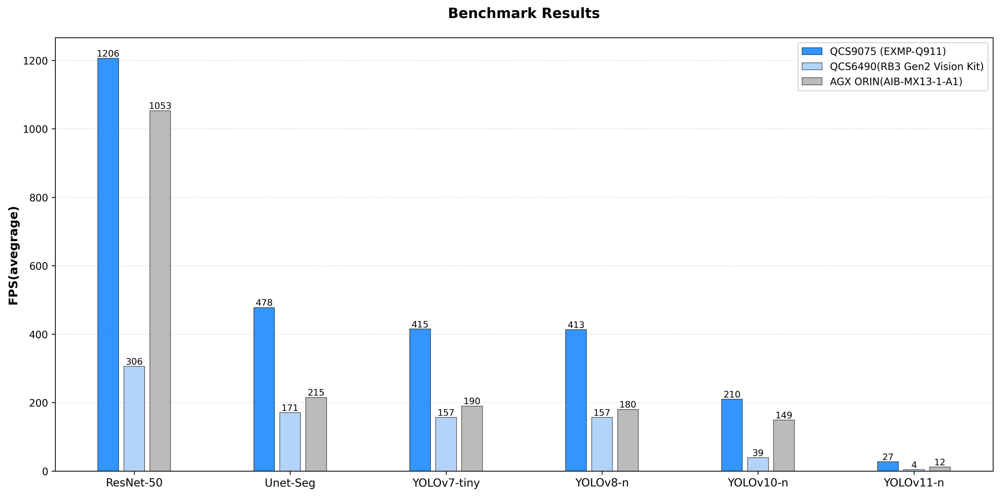

# Perception AI benchmark between QCS9075-EVK and nvidia AGX orin


We conducted a benchmark comparison between two AI computing platforms with similar specifications, evaluating an NPU-based system and a GPU-based system. This benchmark aims to provide a reference for users who prioritize power efficiency and inference performance.

# Benchmark Results

AI inference performance comparison between NPU and GPU.



# Conclusion

NPUs specialize in converting neural networks into hardware pipelines, optimizing the entire inference process for low latency and power efficiency. GPUs, on the other hand, are built for massive parallelism, executing the same computations across large batches of data, making them ideal for training deep neural networks. In practical applications, NPUs can achieve similar or even better inference efficiency than GPUs while consuming significantly less power.

# Platforms Information

| **Platform** | **AIB-MX13-1-A1** | **EXMP-Q911** | **RB3 Gen2 vision kit** |
| --- | --- | --- | --- |
| **SoM / SoC** | Jetson AGX Orin 32GB - Jetpack 5.1.2 [L4T 35.4.1] | Qualcomm QCS9075 | Qualcomm QCS6490 |
| **Power plan** | 30 W | 30 W (High Performance mode) |  |
| **AI Accelerator** | GPU | Single DSP | Single DSP |
| **AI Runtime** | TensorRT | TensorFlow Lite | TensorFlow Lite |
| **AI Performance** | 200 TOPS (Sparse) | 100 TOPS (Dense) | 12 TOPS (Dense) |
| **Linux Kernel** | 5.10.120-tegra | 6.6.90-qli-1.5-ver.1.1-04509-gc4b8666c9a55 | 6.6.90-qli-1.5-ver.1.1-04509-gc4b8666c9a55
 |

# Testing Specifications

We executed benchmarks on the following AI models using both platforms. The table summarizes the model names, input sizes, and corresponding QNN / TensorRT models:

## **Benchmark Execution Commands (applied to all models):**
The following commands are used to benchmark the models across various platforms. FPS is derived from the mean inference time reported by each runtime.

### EXMP-Q911 (Qualcomm QNN):
1. Get the int8 tflite model from the iQ-Studio.

    | Model Name (Download) | Input Size |
    | :--- | :--- |
    | [**YOLOv7-Tiny**](./tflite_model/yolov7.tflite) | 640×640 |
    | [**YOLOv8n**](./tflite_model/yolov8_det.tflite) | 640×640 |
    | [**YOLOv10n**](./tflite_model/yolov10_det.tflitesearchTerm=yolo) | 640×640 |
    | [**YOLOv11n**](./tflite_model/yolov11_det.tflite) | 640×640 |
    | [**ResNet-50**](./tflite_model/resnet50-resnet50-w8a8.tflite) | 224×224 |
    | [**U-Net**](./tflite_model/unet_segmentation-unet-segmentation-w8a8.tflite) | 640×1280 |

2. Run the benchmark using the following command to ensure full delegation to the HTP backend

    ```bash
    benchmark_model --graph=<model_path> \
    --external_delegate_path=/usr/lib/libQnnTFLiteDelegate.so \
    --external_delegate_options='backend_type:htp;library_path:/usr/lib/libQnnHtp.so;skel_library_dir:/usr/lib/rfsa/adsp;htp_performance_mode=2' \
    --enable_op_profiling=true \
    --require_full_delegation=true \
    --num_runs=100 \
    --warmup_runs=10

    # Note:Extract the average inference time (μs) from the output and convert it to FPS.
    # Example output:Timings (microseconds): count=100 first=10390 curr=8377 min=8359 max=10453 avg=9329.78 std=493
    ```

### NVIDIA AGX Orin (TensorRT):

1. Get the float32 ONNX model from the official repository or Qualcomm AI Hub.
    
    | Model Name (Source) | Input Size |
    | :--- | :--- |
    | [**YOLOv7-Tiny**](https://github.com/WongKinYiu/yolov7) | 640×640 |
    | [**YOLOv8n**](https://docs.ultralytics.com/models/yolov8/) | 640×640 |
    | [**YOLOv10n**](https://github.com/THU-MIG/yolov10) | 640×640 |
    | [**YOLOv11n**](https://docs.ultralytics.com/models/yolo11/) | 640×640 |
    | [**ResNet-50**](https://aihub.qualcomm.com/models/resnet50?searchTerm=ResNet) | 224×224 |
    | [**U-Net**](https://aihub.qualcomm.com/models/unet_segmentation?searchTerm=unet) | 640×1280 |

2. Convert the ONNX model into a serialized TensorRT Engine. The --int8 flag is enabled to leverage the Orin Tensor Cores for maximum throughput.


    Note: If the ONNX model is exported with separate weights and network structure files, it is highly recommended to merge them into a single serialized ONNX file.
    
    ```jsx
    /usr/src/tensorrt/bin/trtexec --onnx=<onnx_model_path> --saveEngine=<trt_model_path> --int8
    ```
3. Execute the performance test using the generated Engine.
    ```python
    /usr/src/tensorrt/bin/trtexec \
      --loadEngine=<trt_model_path> \
      --useSpinWait \
      --warmUp=10 \
      --duration=100 \
      --iterations=100 \
      --int8

    # Note:Extract the average inference time (μs) from the output and convert it to FPS.
    # [11/04/2025-00:14:04] [I] GPU Compute Time: min = 1.13281 ms, max = 5.59766 ms, mean = 1.14546 ms, median = 1.14453 ms, percentile(90%) = 1.14844 ms, percentile(95%) = 1.14844 ms, percentile(99%) = 1.15039 ms
    ```