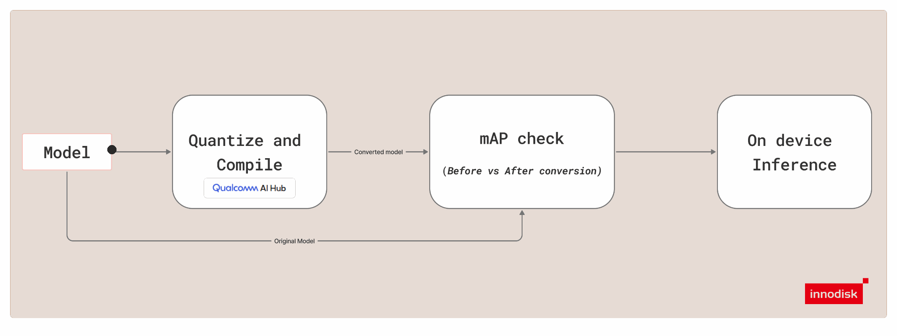

# Model Deploy: End-to-End Guides for Converting, Optimizing, and Running AI Models on the Target Platform

The iQ-Studio Model Deploy feature provides an end-to-end workflow for preparing AI models for deployment on the target platform. The flow covers model quantization, model conversion, quality assurance, and target inference so users can move from a training artifact to deployable outputs with a guided process.

## Overview

The Model Deploy flow is organized around four stages:

1. Quantize the source model.
2. Convert the model to a deployable format.
3. Validate model quality with accuracy checks.
4. Deploy the model and run inference on the target.

The computer vision tutorials for Model Deploy are available under `tutorials/model-deploy/cv`.

To follow the current YOLO workflow, start with [cv/yolo26/README.md](./cv/yolo26/README.md).
