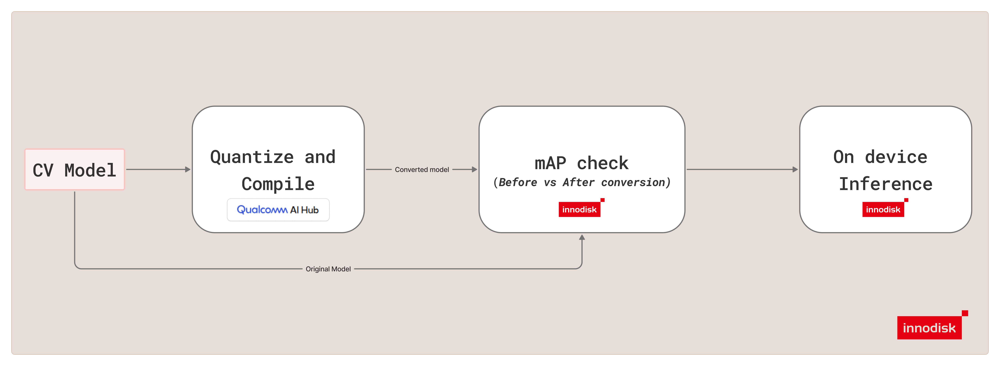
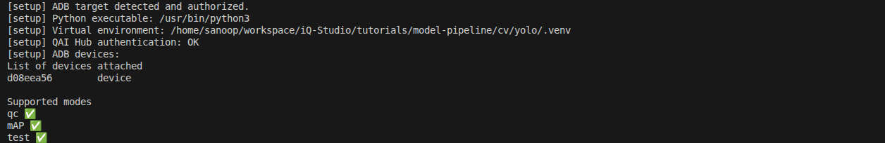
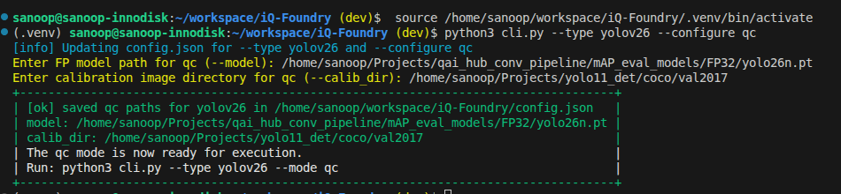
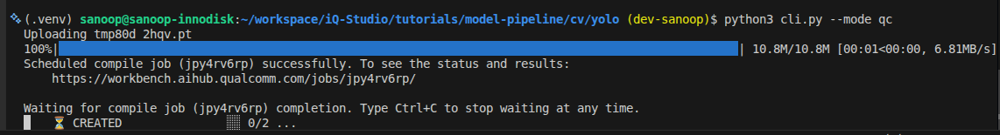
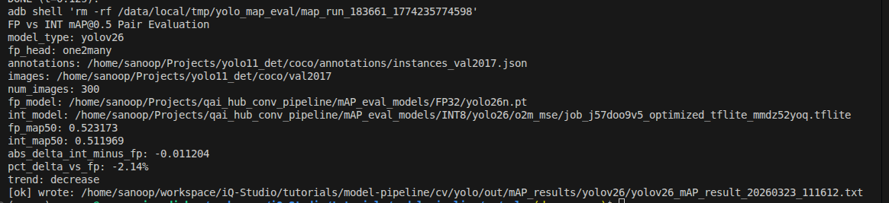
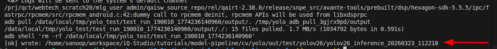
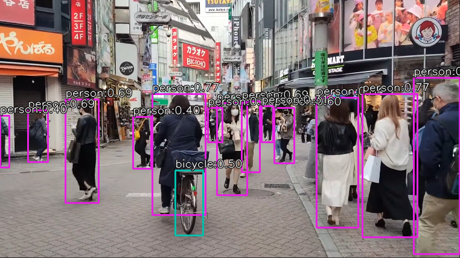

# Model Deploy: How to Convert, Optimize, and Perform Inference with YOLO26 Models?

This iQ-Studio tutorial shows a simple YOLO26 workflow for Qualcomm Dragonwing IQ9. It covers the default flow for INT8 quantization, conversion, quality assurance, and ADB-based inference.



## Overview

This guide follows a straightforward end-to-end flow:

1. Quantize and convert the FP32 YOLO model to INT8 `.tflite` model with Qualcomm AI Hub.
2. Compare FP and INT8 model quality with mAP.
3. Run inference on Qualcomm Dragonwing IQ9 through ADB.

## Requirements

| Item | Requirement |
| --- | --- |
| Host OS | Ubuntu 22.04 |
| Target | EXMP-Q911 (Qualcomm QCS9075) |
| Connection | USB for ADB-based execution |

## Step 1. Connect Device

Connect the Qualcomm Dragonwing IQ9 target to the host with a USB-C cable.


adb reference: [adb overview](https://developer.android.com/tools/adb). No steps are required from that page for this tutorial.

For more about ADB interaction, see [Interact with the system using adb](../../../starting-guides/q911/README.md#interact-with-the-system-using-adb).

## Step 2. Clone the Repository and Set Up the Environment

Clone the iQ-Studio repository, go to the YOLO26 tutorial directory, and source the setup script:

```bash
git clone https://github.com/InnoIPA/iQ-Studio.git
cd iQ-Studio/tutorials/model-deploy/cv/yolo26
source setup.sh
```

This prepares the Python environment, installs the required host packages, and checks ADB access.



## Step 3. Authenticate with Qualcomm AI Hub

Log in to the [Qualcomm AI Hub Workbench](https://aihub.qualcomm.com/).

Navigate to `Account -> Settings -> API Token` to find your unique key.

Configure the host with your API token:

```bash
qai-hub configure --api_token YOUR_API_TOKEN
```

## Step 4. Run the Modes

Follow the steps for each mode below to convert the model (qc), evaluate its quality (mAP), and deploy YOLO inference (test).

### 1. QC

`qc` quantizes the YOLO model to INT8 and converts it from `.pt` to `.tflite`.

Configure the required paths:

```bash
python3 cli.py --configure qc
```

When prompted, enter the requested model and calibration paths.



Run the mode:

```bash
python3 cli.py --mode qc
```

This generates the converted YOLO `.tflite` model in the output directory.



Output location: `out/model/yolov26/`

### 2. mAP

`mAP` compares the FP model and the INT8 model at mAP@0.5.

Configure the required paths:

```bash
python3 cli.py --configure mAP
```

When prompted, enter the requested annotation, image, FP model, and INT8 model paths.

Run the mode:

```bash
python3 cli.py --mode mAP
```

For a smaller validation run, you can limit the number of images:

```bash
python3 cli.py --mode mAP --max-images 5
```

This produces the FP versus INT8 quality comparison report.



Output location: `out/mAP_results/yolov26/`

### 3. Test

`test` runs ADB-based YOLO inference on Qualcomm Dragonwing IQ9 and saves the output artifacts.

Configure the required paths:

```bash
python3 cli.py --configure test
```

When prompted, enter the requested model, YAML, and test image paths.

Run the mode:

```bash
python3 cli.py --mode test
```

This runs inference on the target and saves the generated result artifacts.


<p align="center">
  
</p>

Output location: `out/test/yolov26/`

> 💡 Tip: To review the currently saved mode paths, run `python3 cli.py --configure current`.

## Additional Options


For other YOLO variants and advanced features, use [iQ-Foundry](https://github.com/InnoIPA/iQ-Foundry).

Currently supported YOLO variants in iQ-Foundry include YOLO10, YOLO11, and YOLO26.
