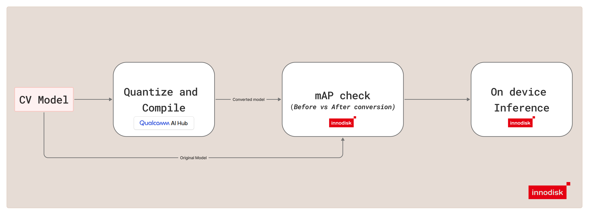
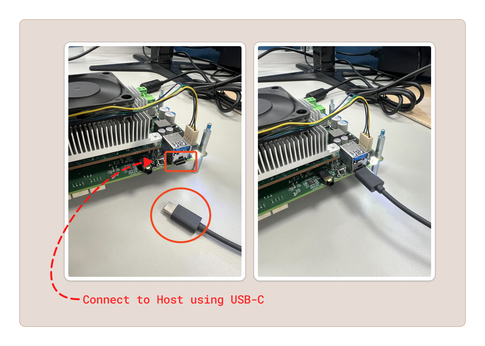
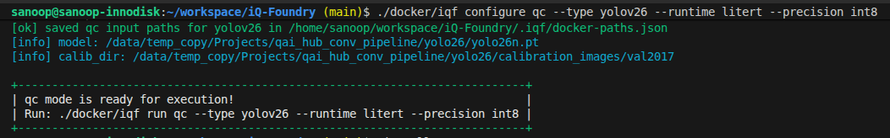
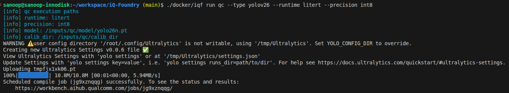
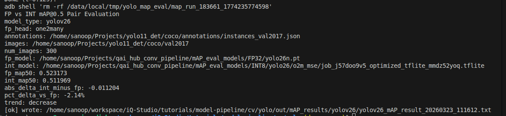
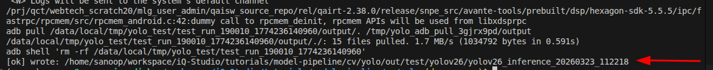

# Model Deploy: How to Convert, Optimize, and Perform Inference with YOLO26 Models

This iQ-Studio tutorial follows the [iQ-Foundry](https://github.com/InnoIPA/iQ-Foundry) YOLO26 workflow for EXMP-Q911 (Qualcomm QCS9075). It covers the default Ubuntu host flow for model preparation, quality assurance, and ADB-based inference through `./docker/iqf`.



## Overview

This guide follows a straightforward end-to-end flow:

1. Quantize and convert the FP32 YOLO model into a deployment-ready `.tflite` model with Qualcomm AI Hub.
2. Compare source and converted model quality with mAP.
3. Run inference on EXMP-Q911 (Qualcomm QCS9075) through ADB from the Ubuntu host.

If you need pretrained YOLO weights (.pt), download the official models from [Ultralytics](https://docs.ultralytics.com/).

## Requirements

| Item | Requirement |
| --- | --- |
| Host OS | x86 Ubuntu 22.04 |
| Target | EXMP-Q911 (Qualcomm QCS9075) |
| Connection | USB-C for ADB-based execution |
| QAI Hub | [Qualcomm AI Hub](https://aihub.qualcomm.com/) API token |

> **Note:** This tutorial follows the Ubuntu host workflow. If you are using Windows, refer to the
> [iQ-Foundry Windows Host Guide](https://github.com/InnoIPA/iQ-Foundry/blob/main/Windows_host.md).

## Step 1. Connect Device

Connect the EXMP-Q911 target to the host with a USB-C cable.



ADB reference: [adb overview](https://developer.android.com/tools/adb). No steps are required from that page for this tutorial.

For more about ADB interaction, see [Interact with the system using adb](../../../starting-guides/q911/README.md#interact-with-the-system-using-adb-over-usb-type-c).

## Step 2. Clone the Repository and Prepare the Host

Clone the iQ-Foundry repository, go to the repository directory, install Docker Engine, and pull the published iQF image:

```bash
git clone https://github.com/InnoIPA/iQ-Foundry.git
cd iQ-Foundry
bash ./docker_install.sh
docker pull innodiskorg/iqf:latest
```

Docker Engine and the published `innodiskorg/iqf:latest` image provide the prepared runtime used by `./docker/iqf` on the Ubuntu host.

## Step 3. Authenticate with Qualcomm AI Hub

Log in to the [Qualcomm AI Hub Workbench](https://aihub.qualcomm.com/).

Navigate to `Account -> Settings -> API Token` to find your unique API token.

Authenticate the host workflow with your API token:

```bash
./qaihub_login.sh --key <YOUR_QAI_HUB_API_KEY>
```

## Step 4. Run the Modes

> Note: The examples below use `yolov26` with `--runtime litert --precision int8`.

Follow the steps for each mode below to convert the model (qc), evaluate its quality (mAP), and deploy YOLO inference (test).

### 1. QC

`qc` converts a supported FP `.pt` model into a deployment-ready artifact through QAI Hub.

Configure the required paths:

```bash
./docker/iqf configure qc --type yolov26 --runtime litert --precision int8
```

When prompted, enter the requested model and calibration paths.



Run the mode:

```bash
./docker/iqf run qc --type yolov26 --runtime litert --precision int8
```

This generates the converted YOLO artifact in the output directory.



Output location: `out/model/yolov26/yolov26_litert_int8_<timestamp>.tflite`

### 2. mAP

`mAP` compares source versus converted model quality at `mAP@0.5`. The source model runs on the
host, and the converted model runs on EXMP-Q911 (Qualcomm QCS9075) through ADB.

Configure the required paths:

```bash
./docker/iqf configure mAP --type yolov26 --runtime litert --precision int8
```

When prompted, enter the requested annotation, image, FP model, and converted model paths.

Run the mode:

```bash
./docker/iqf run mAP --type yolov26 --runtime litert --precision int8
```

For a smaller validation run, you can limit the number of images:

```bash
./docker/iqf run mAP --type yolov26 --runtime litert --precision int8 --max-images 5
```

This produces the source-versus-converted quality comparison report.

For `yolov10` and `yolov26`, if the converted model was generated with `--qc-head one2one`, run
`mAP` with `--fp-head one2one` so the FP branch matches the converted model.



Output location: `out/mAP_results/yolov26/yolov26_mAP_result_litert_int8_<timestamp>.txt`

### 3. Test

`test` runs converted-model inference on EXMP-Q911 (Qualcomm QCS9075) through ADB from the host
and saves the output artifacts.

Configure the required paths:

```bash
./docker/iqf configure test --type yolov26 --runtime litert --precision int8
```

When prompted, enter the requested model, YAML, and test image paths.

Run the mode:

```bash
./docker/iqf run test --type yolov26 --runtime litert --precision int8 --adb
```

This runs inference on the target and saves the generated result artifacts.


<p align="center">
  
</p>

This inference example was generated using a pretrained [Ultralytics YOLO26 model](https://docs.ultralytics.com/models/yolo26/).

Output location: `out/test/yolov26/yolov26_inference_litert_int8_<timestamp>/`

> 💡 Tip: To review the currently saved mode paths, open `.iqf/docker-paths.json`.

## Use iQ-Foundry for More Options

This iQ-Studio tutorial focuses on the default `yolov26` workflow with LiteRT INT8. If you want
to use other YOLO models, precisions, or runtimes, continue with the
[iQ-Foundry](https://github.com/InnoIPA/iQ-Foundry/tree/main) Ubuntu or Windows host guide and adjust the `--type`, `--runtime`, and `--precision` options there.

### iQ-Foundry Supports: 

<div align="center">
  <table>
    <tr>
      <th>Category</th>
      <th>Supported Options</th>
    </tr>
    <tr>
      <td>YOLO models</td>
      <td><code>yolov10</code>, <code>yolov11</code>, <code>yolov26</code></td>
    </tr>
    <tr>
      <td>Runtimes</td>
      <td>LiteRT, ONNX Runtime</td>
    </tr>
    <tr>
      <td>Precisions</td>
      <td>FP32, <code>w8a16</code> (mixed precision), INT8</td>
    </tr>
  </table>
</div>
