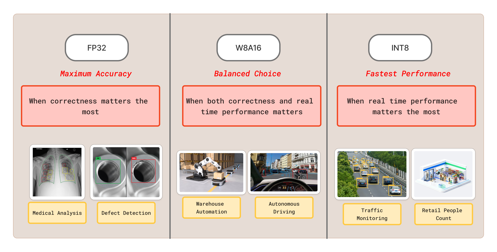

# iQ-Foundry Model Selection Guide

Choose the model precision and runtime that best match your application's accuracy, speed, and deployment requirements.

## Purpose of This Guide

This iQ-Studio guide helps you choose an [iQ-Foundry](https://github.com/InnoIPA/iQ-Foundry) model based on accuracy, performance, size, memory, precision, runtime, and acceptable accuracy change. The best choice depends on the application, so treat each recommendation as a starting point.

## Supported Models and Deployment Choices

iQ-Foundry supports the **YOLOv10n**, **YOLOv11n**, and **YOLOv26n** model varients.

| Runtime      | FP32 | INT8 | W8A16 |
| ------------ | :--: | :--: | :---: |
| LiteRT       |   ✓  |   ✓  |   ✗   |
| ONNX Runtime |   ✓  |   ✗  |   ✓   |

> [!NOTE]
> All model conversion, quality checks, and testing are performed using [iQ-Foundry](https://github.com/InnoIPA/iQ-Foundry).

## Which Precision Should You Choose?

  

> [!NOTE]
> The image shows simple starting points. It does not guarantee accuracy, speed, or suitability for an application. Actual results depend on the model and application data.

| Starting Choice       | Choose It When | Key Trade-offs |
| --------------------- | -------------- | -------------- |
| FP32                  | Accuracy is the main priority, or calibration images are unavailable. | Largest model and usually slower; works with LiteRT or ONNX Runtime. |
| W8A16 + ONNX Runtime | You need a balance, or INT8 loses too much accuracy. | Smaller than FP32; requires calibration; results depend on the model. |
| INT8 + LiteRT        | Speed, size, and power efficiency are the main priorities. | Smallest option; requires calibration and may reduce accuracy more. |

## Recommendations by Use Case

| Use Case                                        | Recommended Choice              | Why |
| ----------------------------------------------- | ------------------------------- | --- |
| Medical image analysis                          | FP32 (LiteRT or ONNX Runtime)   | Accuracy is more important than speed. Start with FP32, then complete strict validation using application-specific data and requirements. |
| Industrial defect inspection                    | FP32 or W8A16                   | Small defects may be difficult to detect. Use FP32 when accuracy is the priority, or evaluate W8A16 when a smaller model is needed. |
| Traffic monitoring                              | INT8 + LiteRT                   | Multiple camera streams require fast inference and efficient hardware use. A measured accuracy reduction may be acceptable for the application. |
| Retail customer counting                        | INT8 + LiteRT                   | Real-time processing, low latency, and low power use are often more important than maximum precision for continuous customer counting. |
| Smart security camera                           | INT8 + LiteRT                   | Continuous inference benefits from a small, efficient model when the camera has limited power, memory, or storage. |
| Autonomous mobile robot                         | INT8 or W8A16                   | Fast reactions are important. Start with INT8 for low latency, or evaluate W8A16 when INT8 does not meet the required accuracy. |
| Warehouse object detection                      | INT8 + LiteRT                   | Continuous video streams require fast detection of boxes, pallets, and workers while using hardware resources efficiently. |
| Drone-based detection                           | INT8 + LiteRT                   | Drones have limited power, memory, and cooling capacity. A smaller model helps reduce the resources needed for continuous detection. |
| Quality inspection with similar-looking defects | W8A16 + ONNX Runtime            | W8A16 can balance a smaller model with better accuracy retention than full INT8. Confirm the result using images of the target defects. |

> [!IMPORTANT]
> These are starting points, not safety or compliance guarantees. Test the final model with the actual camera, environment, dataset, and application requirements.

> [!TIP]
> **Faster postprocessing:** YOLOv10 and YOLOv26 users can evaluate the O2O output head with the MinMax setting. O2O can reduce NMS work that removes overlapping detections, but its accuracy must be compared with the default O2M head. YOLOv11 uses its default output head, and O2O does not guarantee lower model invocation latency or a faster complete application.
> See [qc_mode.md](https://github.com/InnoIPA/iQ-Foundry/blob/main/docs/qc_mode.md) for guidance on choosing output flags and quantization schemes.

## Recommended Selection Process

1. Choose the main priority: accuracy, balance, or efficiency.
2. Select a compatible runtime and precision.
3. Review the [iQ-Foundry Model Benchmark](../../../benchmarks/iqf-models/README.md).
4. Use [iQ-Foundry](https://github.com/InnoIPA/iQ-Foundry) to test with real application images, then select the smallest, fastest model that meets the required accuracy.
